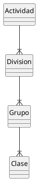
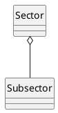
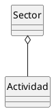

# Actividad Económica

#DEFINICION Una actividad económica es cualquier actividad relacionada con la producción, el intercámbiio y el consumo de bienes o servicios.

Vamos a encontrar dos clasificaciones: CNAE y Sector Económico.

## CNAE (Clasificación Nacional de Actividades Económicas)
#DEFINICION Es una clasificación de las actividades económicas que recoge la Normativa Europea establecida en el ce 1893/2006. Actualmente está vigente la [CNAE-2009](https://www.cnae.com.es/).

***Estructura de la CNAE***

#DEFINICION  *Código CNAE -* Código de clase en la clasificación CNAE (4 digitos).  Coloquialmente se le conoce como código de Actividad CNAE aunque esto sea estrictamente incorrecto.

#ADVERTENCIA en el RIASAT se utiliza la nomenclatura CNAE-1993 (6 digitos) mientras que la actualmente vigente es CNAE-2003 (4-digitos).

#ADVERTENCIA El nivel de desglose de la clasificación CNAE es insuficiente para las necesidades de RIA. 

***Ejemplo CNAE-2003**

|Código CNAE| Descripción |
|:--:|:--|
|0111 |Cultivo de cereales (excepto arroz), leguminosas y semillas oleaginosas|
|0112|Cultivo de arroz|
|0113|Cultivo de hortalizas, raíces y tubérculos|

## Clasificación JCCM de actividades economicas de Agricultura

Para conseguir el nivel de detalle necesario, la Consejería de Agricultura de JCCM ha definido su propia clasificación jerárquica basada en CNAE pero **no exactamente correspondiente con ella**.

### Sector / Subsector
Se ha definido una jerarquía Sector/Subsector para definir la clasificación de actividades económicas.

#DEFINICION *Sector económico -* Agrupación de actividades económicas de 1er nivel ( el más genérico ) para las actividades relacionadas con industrias agroalimentarias en Castilla-La Mancha.

#DEFINICION *Subsector económico -* Agrupación de 2º nivel para las actividades económicas relacionadas con las industrias agroalimentarias en Castilla-La Mancha.

Una [industria](Establecimientos.md) registrada debería estar asociada a un sector y subsector económico.

#PENDIENTE Actualmente se está creando una hoja de equivalencias Código CNAE <-> Sector/Subsector.

### Sector / Actividad
Simultaneamente se ha definido una jerarquía [Sector](#Sector /Subsector)/Actividad

#DEFINICION *Actividad económica -* Descripción de alto nivel de una actividad relacionada con una industria agroalimentaria en Castilla-La Mancha.

El nivel de detalle de la *Actividad* es mayor que el de *subsector*.

Una [industria](Establecimientos.md) debería realizar, al menos, una actividad económica para poder ser catálogada como [Establecimiento](./Establecimientos.md).

#ADVERTENCIA Parece razonable pensar que debería haber una jerarquía de tres niveles Sector/Subsector/Actividad y no dos jerarquías paralelas que no parecen aportar información adicional.
#PENDIENTE Concretar con las usuarias gestoras. 

