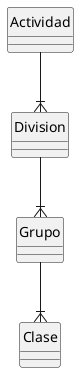

# Actividad Económica

#DEFINICION Una actividad económica es cualquier actividad relacionada con la producción, el intercámbiio y el consumo de bienes o servicios.

Vamos a encontrar dos clasificaciones: CNAE y Sector Económico.

## CNAE (Clasificación Nacional de Actividades Económicas)
#DEFINICION Es una clasificación de las actividades económicas que recoge la Normativa Europea establecida en el ce 1893/2006. Actualmente está vigente la [CNAE-2009](https://www.cnae.com.es/).

***Estructura de la CNAE***

#ADVERTENCIA Aunque, estrictamente, la clasificación CNAE corresponde al anterior diagrama, lo más habítual es utilizar el código asociado a la clase (4 dígitos) y denominarlo, coloquialmente, cómo **código CNAE**.

***Ejemplo**

|Código CNAE| Descripción |
|:--:|:--|
|0111 |Cultivo de cereales (excepto arroz), leguminosas y semillas oleaginosas|
|0112|Cultivo de arroz|
|0113|Cultivo de hortalizas, raíces y tubérculos|

## Sector/Subsector/Actividad.
Dado que el código CNAE enumera unos docenas de actividades, resulta demasiado genérico para determinar la actividad económica concreta que se realiza en un establecimiento de cara a la clasificación por grupo de actividad o la emisión de [Certificados].

#PENDIENTE Definir certificados.

La Consejería de Agricultura de JCCM ha definido su propia clasificación jerárquica de tres niveles basada en CNAE pero **no exactamente correspondiente con ella**

#PENDIENTE Actualmente se está creando una hoja de equivalencias Código CNAE <-> Sector/Subsector.