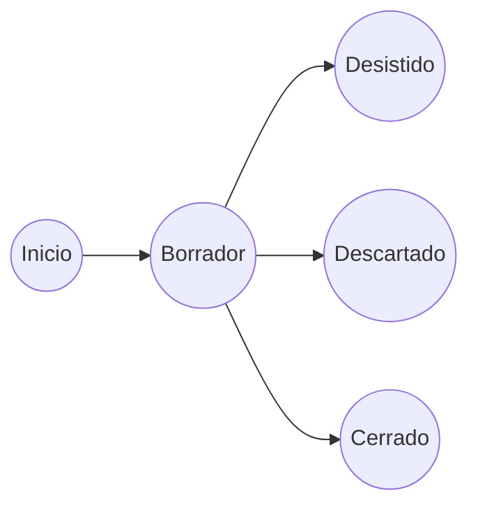

# Analisis Expediente Empresa. RIA

#DEFINICION Un Expediente de Empresa esta asociado **a una solicitud de inscripción/modificación** asociadas a una empresa en el RIA.

#Nota en un mismo documento de solicitud pueden solicitarse varias acciones simultaneamente.

#Nota  Consideramos sinonimos los términos *industria* y *empresa* .
#Nota  Consideramos sinonimos los términos *solicitud* y *expediente* .

## Tipos de Acción solicitada.
En el documento de Solicitud de inscripción/modificación en RIA,  **S707_25281**, se permiten solicitar los siguientes tipos de acción:

	- Inscripción de la industria RIA.
	- Baja en la industria RIA.
	- Inscripción de la ampliación/perfeccionamiento.
	- Cambio de Actividad/ampliación de la actividad.
	- Cambio de la titularidad de la industria.
	- Renovación de Certificado.

**En la aplicación RIASAT una solicitud encontramos las siguientes tipos de expediente:**
|Tipo solicitud| Descripcion | Ambito|
|:--|:--|:--|
|	AMPLIACION	| Se amplían o modifican los datos de establecimientos| Establecimiento |
|	ARRENDAMIENTO | Se notifica el arrendamiento de un nuevo establecimiento| Establecimiento |
|	BAJA | Baja voluntaria o de oficio. Mezcla cese de actividad, desaparición de la empresa, traslado a otra comunidad, falta de documentación no solventable, no renovación, etc.  | Empresa |
|	CAMBIO DE ACTIVIDAD | Se notifica un cambio de actividad de la empresa | Empresa, Establecimiento | 
|	CAMBIO DE TITULAR | Todos transfieren todos los datos a una nueva empresa| Empresa |
|	INSTALACION | Modificación sustancial de los establecimientos | Establecimiento|
|	LEGALIZACION |Inscripciones de oficio por errores en los datos del propietario | Empresa |
|	MEJORAS	|Inversiones | Establecimiento |
|	PERFECCIONAMIENTO |Inversiones| Establecimiento |
|	REDUCCION | Abandono actividad.  En desuso| Empresa, Establecimiento |
|	REVISION | Cajón de sastre| Empresa, Establecimiento |
|	TRASLADO | Se notifica el traslado de la empresa o de parte o todos los establecimientos |
|	CAMBIO DE DENOMINACION	| Se notifica el cambio de nombre de la empresa |Empresa |
|	EXPEDICION CERTIFICADO	| Se solicita la emisión de un documento de certificación| Empresa |
|	INSTALACION-AMPLIACION	|Responde a los casos del documento de solicitud | Empresa, Establecimiento |
|	RENOVACION	|Renovaciones RIA, cajón de sastre| Empresa, Establecimiento |

`Distribución de expedientes por tipo de solicitud`
| Tipo exp  |Nº expeds.		|Ultimo año uso|
|:--:|:--:|:--:|
| AMP	| 3885	| 2021       |
| INS	| 2566	| 2022       |
| REN	| 2320	| 2021       |
| CTT	| 1394	| 2021       |
| PER	| 1074	| 2021       |
| 		| 816	|            |
| LEG	| 775	| 2021       |
| MEJ	| 627	| 2022       |
| REV	| 526	| 2021       |
| ARR	| 291	| 2021       |
| BAJ	| 289	| 2020       |
| TRS	| 160	| 2019       |
| CDM	| 148	| 2021       |
| INA	| 130	| 2021       |
| CAC	| 41	| 2019       |
| EXC	| 20	| 2020       |
| RED	| 7		| 2015       |

#nota La descripción es orientativa. La realidad es que se han ido usando indistintamente.

## Estado del expediente.
Actualmente en la aplicación RIASAT solo se permiten dos estados:
	- Abierto.
	- Cerrado

`Distribución de expedientes por estado y último año de uso`
| Estado| Nº Expeds	| Último año uso| 
|:--:|--:|:--:|
| Cerrado | 4272		| 2022| 
| 		| 10427	    |     | 
| Abierto | 370		| 2019| 

## Propuesta Estados del expediente.

`Estados propuestos`
| Estado | Descripción| Editable |
|:--|:--|:--:|
| Borrador | Se ha iniciado la grabación del expediente y pueden hacerse modificaciones sobre él. | S |
| Desistido | El solicitante indicó la cancelación de la tramitación del expediente | N |
| Descartado | El usuario canceló la tramitación del expediente de oficio| N |
| Cerrado | El usuario finalizó la tramitación del expediente | N |

## Reglas elicitadas.
### 1. Cada acción realizada sobre la aplicación está asociada a un expediente.

### 2. Cada tipo solicitud puede 

