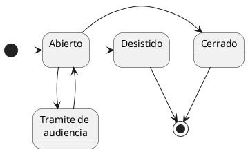

# Expedientes

#DEFINICION Un expediente registra una inscripción/modificación/baja en el RIA.

Un expediente **siempre está asociado a una empresa**.

#DEFINICION *Empresa -* Persona física o jurídica identificada por un NIF.

#ADVERTENCIA **No es posible realizar ninguna modificación sobre el RIA si no existe previamente un expediente al que asociarla**.

Un expediente se puede iniciar bien a instancia del **interesado**, bien de **oficio**.

## Expediente a instancia del interesado.

#DEFINICION *Expediente a instancia del interesado -* Se inicia a petición de una persona física o jurídica y **siempre debería estar basado en la presentación en una [solicitud](../Solicitudes)**.

Cada expediente a instancia del interesado debería poder referenciar tanto la solicitud cómo el resto de documentación aportada.

#ADVERTENCIA ***En la base de datos actual no existe este enlace al documento de solicitud ni al resto documentación aportada****.

En caso de no aportar toda la documentación requerida el expediente no debería poder darse por válido. 

#ADVERTENCIA No existe un catálogo de documentación necesaria ni a nivel de expediente ni a nivel de tipo de acción solicitada.

## Expedientes iniciados de oficio
No están asociados a una solicitud.

Deben estar motivados.

Posibles motivos de expedientes de oficio son:
	- Corrección de datos introducidos erroneamente durante la mecanización de las solicitudes.
	- Campañas de actualización de datos asociadas a programas específicos.
	- #PENDIENTE ****Ampliar con las usuarias***.

## Ciclo de vida del expediente.
Actualmente solo hay tres estados posibles, **ABIERTO**, **CERRADO**, e **INDETERMINADO**.
Esta situación deviene de una mala gestión de la aplicación actual.

**Propuesta estados posibles**
| Estado               | Descripción  |   
|:--|:--|
| Abierto              | Permite la edición de los datos asociados a la empresa. |
| Cerrado              | Se terminó satisfactoriamente la edición de los datos asociados a industria.  **Un expediente CERRADO no puede reabrirse**. |                       |                                                                                                                                    
| Desistido            | El **interesado** solicitó la cancelación de la tramitación del expediente. |                                                                                                                                                                                                     
| Trámite de Audiencia | Se ha solicitado documentación no presentada junto a la solicitud.                                                             

***Ciclo de vida del expediente***

#PENDIENTE ***¿Existe alguna circunstancia en que pueda reabrirse un expediente ya cerrado?*** ¿O necesitaría un nuevo expediente de Oficio?

