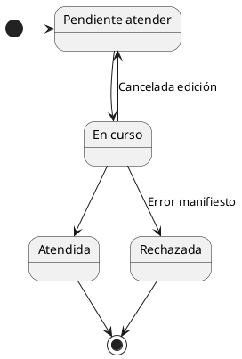

# Solicitudes

#DEFINICION Una solicitud es un documento donde una empresa o particular expresa su intención de realizar una modificación en el RIA y debería estar acompañado de la Ficha Técnica y/o documentación acreditativa necesaria.

##### Una solicitud siempre se inicia a instancias de una [persona física o jurídica](./Empresas)

| |  SOLICITUDES AL REGISTRO DE INDUSTRIAS AGROALIMENTARIAS                 |
|:--|:--|
| |La presentación de solicitudes se define  a través del procedimiento ***[S707 - 020127 REGISTRO DE INDUSTRIAS AGRARIAS](https://www.jccm.es/tramitesygestiones/registro-de-industrias-agrarias)***.|
| |Existe un documento de solicitud [S707_25281.DOC](https://www.jccm.es/sites/www.jccm.es/files/modelos/S707_25281.DOC) y una [Ficha Técnica](https://www.jccm.es/sites/www.jccm.es/files/modelos/S707_28664.XLS).|
| |Además de los formatos Word y Excel indicados, las solicitudes y ficha técnica pueden presentarse en formato papel de forma presencial.|
| | La documentación adicional puede admitir tanto papel como cualquier otro formato incluyendo documentos o imagenes escaneadas.

Un **solicitud** puede implicar una o varias de las siguientes acciones.
	- Inscripción de una industria en el RIA.
	- Modificación de los datos de una industria.
	- Baja de una industria en el RIA
	- Cambio o ampliación de la actividad.
	- Cambio en la titularidad de una industria.
	- Solicitud de emisión de un certificado para una industria.

Cada acción puede implicar necesidades de documentación distintas.

#DEFINICION *Industria -* Conjunto de instalaciones dedicadas a una actividad económica. En este caso estarán determinadas por su relación con la persona física que presenta la solicitud.

## Ciclo de vida de la Solicitud
- La recepción de una solicitud es el evento que inicia el Registro.

- No se puede registrar una solicitud en RIA mientras haya otra solicitud en curso sobre la misma industria en curso.

***Ciclo de vida de la solicitud*** 

